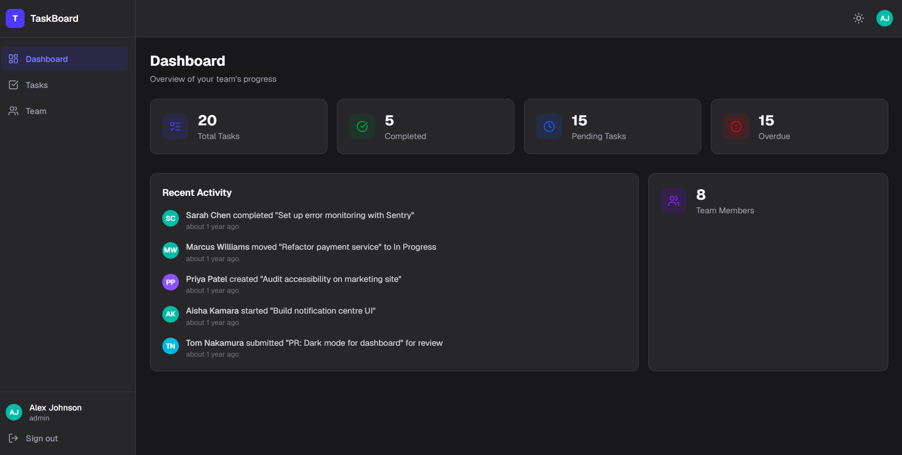
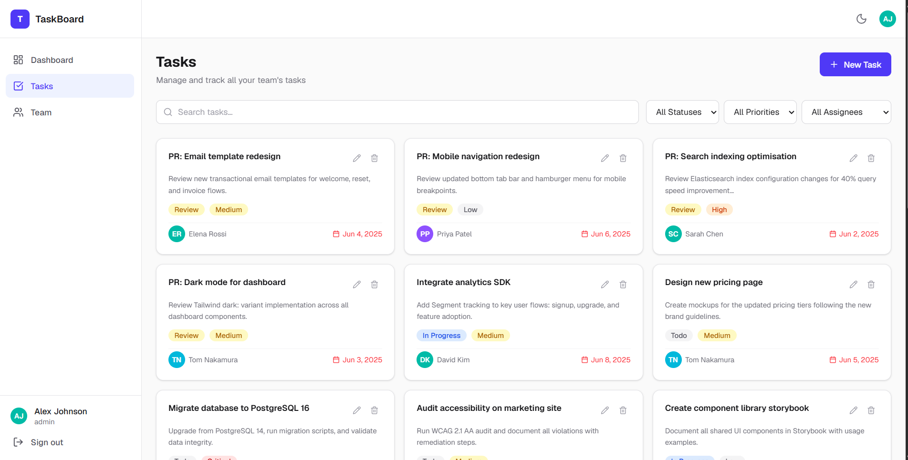
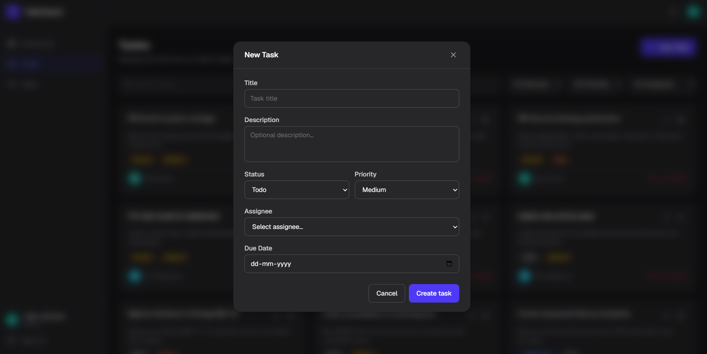
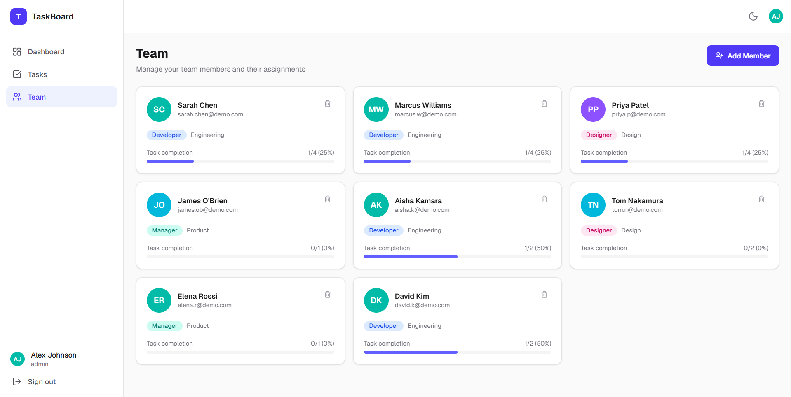

# TaskBoard — Task & Team Management Dashboard

A modern, fully responsive dashboard for managing tasks and team members, built as a Frontend Developer Internship Assignment.



---

## Live Demo

🔗 [View Live on Vercel](https://task-team-dashboard.vercel.app) <!-- replace with your actual URL -->

> **Demo credentials**
> ```
> Email:    alex@demo.com
> Password: password123
> ```

---

## Screenshots

### Dashboard

Stat cards showing Total Tasks, Completed, Pending, and Overdue counts — with a live activity feed and team member count.

### Task Management

Full task list with search, multi-filter (status, priority, assignee), and card grid layout.

### New Task Modal

Create or edit tasks with full Zod validation — title, description, status, priority, assignee, and due date.

### Team Members

Team member cards showing role, department, email, and task completion progress bar.

---

## Features

| Feature | Details |
|---|---|
| Authentication | Login + Forgot Password with Zod form validation |
| Dashboard Stats | Total, Completed, Pending, Overdue tasks + Team Members |
| Task Management | Create, Edit, Delete with confirmation, Search (debounced), Filter |
| Team Management | View, Add, Remove members with task progress tracking |
| Dark Mode | Toggle with localStorage persistence |
| Responsive | Mobile drawer sidebar, fluid card grids |
| Animations | Page fade-in, card stagger, modal scale-in, toast slide-in |
| Route Protection | Auth guard via Next.js proxy middleware |

---

## Tech Stack

| | |
|---|---|
| Framework | Next.js 16 (App Router) |
| Language | TypeScript 5 |
| Styling | Tailwind CSS v4 |
| Validation | Zod |
| State | React Context API |
| Icons | Lucide React |
| Dates | date-fns |

---

## Getting Started

### Prerequisites
- Node.js 18+
- npm

### Installation

```bash
# Clone the repo
git clone https://github.com/YOUR_USERNAME/task-team-dashboard.git
cd task-team-dashboard

# Install dependencies
npm install

# Start dev server
npm run dev
```

Open [http://localhost:3000](http://localhost:3000) and log in with the demo credentials above.

### Production Build

```bash
npm run build
npm run start
```

---

## Project Structure

```
src/
├── app/
│   ├── (auth)/              # Login, Forgot Password
│   ├── (dashboard)/         # Dashboard, Tasks, Team
│   └── layout.tsx           # Root layout + all providers
├── components/
│   ├── ui/                  # Button, Input, Modal, Badge, Avatar, Toast...
│   ├── layout/              # Sidebar, Topbar, PageHeader
│   ├── dashboard/           # StatCard, ActivityFeed
│   ├── tasks/               # TaskCard, TaskList, TaskFilters, TaskFormModal
│   └── team/                # MemberCard, MemberList, MemberFormModal
├── context/                 # ThemeContext, AppContext, TaskContext, TeamContext
├── hooks/                   # useLocalStorage
├── lib/                     # utils.ts, validators.ts
├── data/                    # mockUser, mockTasks, mockTeam
└── types/                   # All TypeScript interfaces
```

---

## Deployment

Deployed on [Vercel](https://vercel.com). Every push to `main` triggers an automatic redeployment.

To deploy your own:
1. Push this repo to GitHub
2. Go to [vercel.com/new](https://vercel.com/new) → Import the repo
3. Set **Root Directory** to `task-team-dashboard`
4. Click **Deploy** — no environment variables needed
